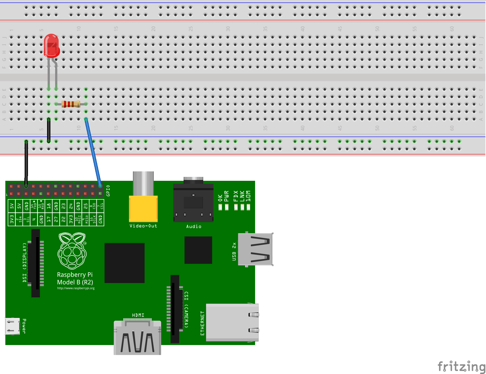
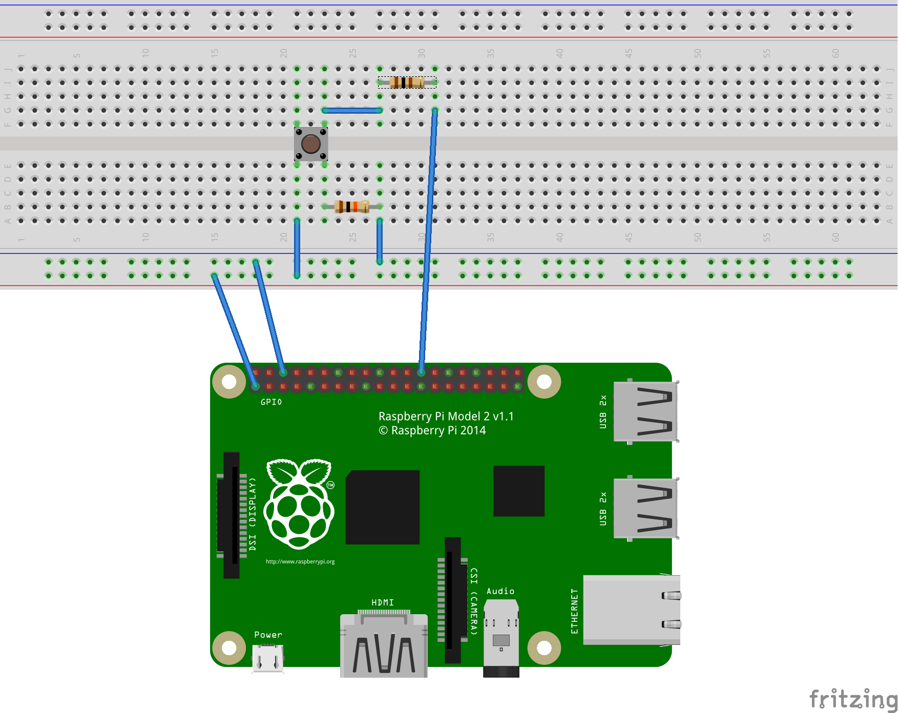
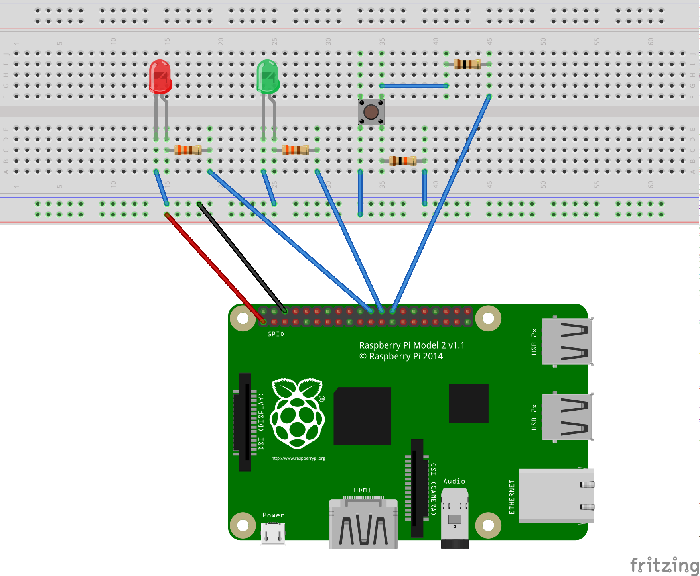

# RpiGpio Examples

## Output
Very basic example showing how to toggle an LED on/off

[Example Code](./output.go)

## Input
Demonstration of reading input from a push button.  This does not use the pull up/down feature of the Raspberry Pi GPIO pins.  Instead the pull down is built into the circuit itself.

[Example Code](./output.go)

## Input/Output
Building on the Input and Output examples above we toggle between a red and green led based on the switch position.

[Example Code](./output.go)

